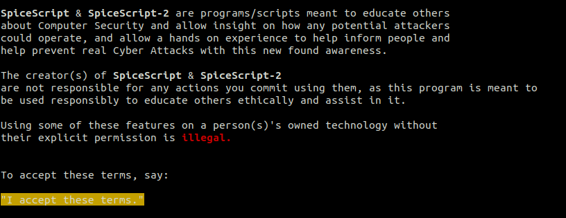

<h1>SpiceScript 2</h1>
<p align="center">
  <a href="https://github.com/spicesouls/spicescript2">
    
  </a>
  <p align="center">
    Your Handy Dandy Cyber Swiss Army Knife
    <br />
    <a href="https://github.com/spicesouls/spicescript2"><strong>Explore the docs »</strong></a>
    <br />
    <br />
    <a href="https://github.com/spicesouls/spicescript2/blob/master/README.md#guide">Installation & Usage Guide</a>
    ·
    <a href="https://github.com/spicesouls/spicescript2/issues">Report Bug</a>
    ·
    <a href="https://github.com/spicesouls/spicescript2/issues">Request Feature</a>
  </p>
</p>
</p>

# Guide

## Installation

### Commands

```sh
git clone https://github.com/spicesouls/spicescript2
cd spicescript2
pip3 install -r requirements.txt
chmod +x spicescript2.py
chmod +x add-to-bin.sh
./add-to-bin.sh
spicescript2
```

### One Liner

```sh
echo 'git clone https://github.com/spicesouls/spicescript2; cd spicescript2; pip3 install -r requirements.txt; chmod +x spicescript2.py; chmod +x add-to-bin.sh; ./add-to-bin.sh; echo ""; echo ""; echo "Ready for running!"; echo ""' | sh
```

<p align="center">
  <a href="https://github.com/spicesouls/spicescript2">
    
  </a>
</p>
